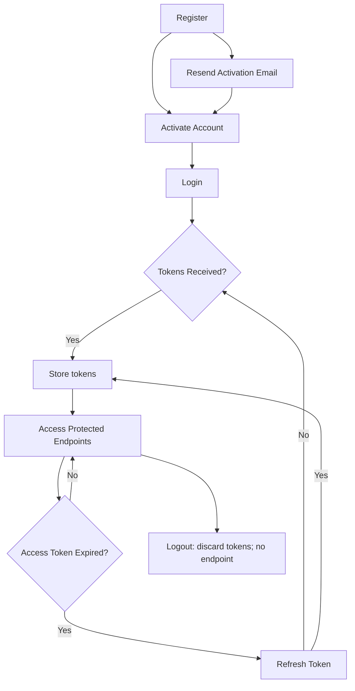

# Authentication API

The Authentication API provides endpoints for user authentication, token management, and password operations.

## Base Endpoint

```bash
/api/auth
```

<Callout type='info'>
  The system will automatically set authentication cookies with the generated tokens upon login or refresh. You usually don't need to handle the tokens manually unless your use-case is purely token-based.
</Callout>

<Cards>
    <Cards.Card 
      icon={<PostmanIcon />}
      title='BSH Engine Collection'
      href='https://www.postman.com/altimetry-participant-52635096/bsh-engine/folder/lbjr75s/authentication'
      target='_blank' />
</Cards>

## Endpoints

| Method | Endpoint | Description |
|--------|----------|-------------|
| [POST](/docs/bsh-engine/api/authentication/register) | `/api/auth/register` | Register new user |
| [POST](/docs/bsh-engine/api/authentication/activate-account) | `/api/auth/activate-account` | Activate user account using verification code |
| [POST](/docs/bsh-engine/api/authentication/login) | `/api/auth/login` | Authenticate user with email and password |
| [POST](/docs/bsh-engine/api/authentication/refresh-token) | `/api/auth/refresh` | Refresh expired access token |
| [POST](/docs/bsh-engine/api/authentication/forgot-password) | `/api/auth/forget-password` | Request password reset code via email |
| [POST](/docs/bsh-engine/api/authentication/reset-password) | `/api/auth/reset-password` | Reset password using verification code |
| [POST](/docs/bsh-engine/api/authentication/resend-activation-email) | `/api/auth/resend-activation-email` | Resend activation email to the user |

## Token Usage

The Engine API supports two methods of authentication. You can use either one depending on your use case.

<Tabs items={['bearer', 'cookies', 'ApiKeys']}>
  <Tabs.Tab>
  Include the access token in the `Authorization` header:
  ```
  Authorization: Bearer {{accessToken}}
  ```
  </Tabs.Tab>
  <Tabs.Tab>
  Authentication can be handled automatically via `cookies`. This is useful when making requests from a browser where the session cookie is already present.
  </Tabs.Tab>
  <Tabs.Tab>
  Include your API key in the [`X-BSH-APIKEY`](/docs/bsh-engine/security/api-keys#using-your-api-key) header for all API requests:
  ```
  X-BSH-APIKEY: {{ApiKey}}
  ```
  </Tabs.Tab>
</Tabs>


## Authentication Flow


