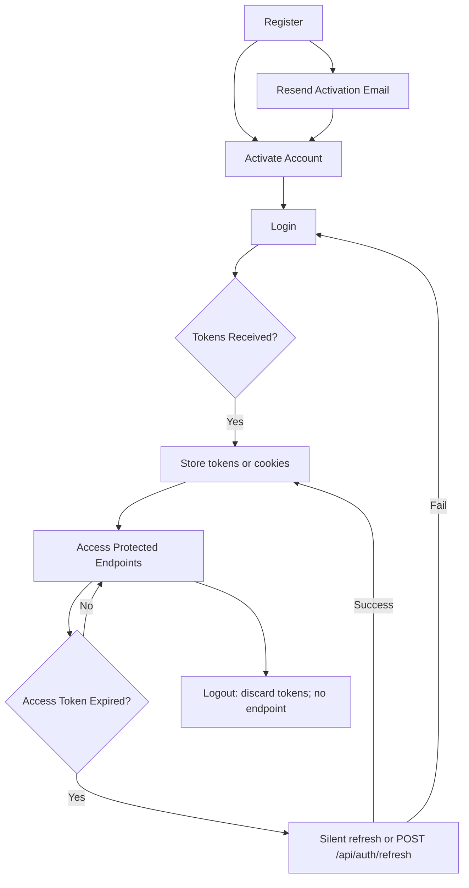

import { Callout } from 'nextra/components';

# Authentication API

The Authentication API provides endpoints for user authentication, token management, and password operations.

## Base Endpoint

```bash
/api/auth
```

<Cards>
    <Cards.Card 
      icon={<PostmanIcon />}
      title='BSH Engine Collection'
      href='https://www.postman.com/altimetry-participant-52635096/bsh-engine/folder/lbjr75s/authentication'
      target='_blank' />
</Cards>

## Endpoints

| Method | Endpoint | Description |
|--------|----------|-------------|
| [POST](/docs/bsh-engine/api/authentication/register) | `/api/auth/register` | Register new user |
| [POST](/docs/bsh-engine/api/authentication/activate-account) | `/api/auth/activate-account` | Activate user account using verification code |
| [POST](/docs/bsh-engine/api/authentication/login) | `/api/auth/login` | Authenticate user with email and password |
| [POST](/docs/bsh-engine/api/authentication/refresh-token) | `/api/auth/refresh` | Refresh expired access token |
| [POST](/docs/bsh-engine/api/authentication/forgot-password) | `/api/auth/forget-password` | Request password reset code via email |
| [POST](/docs/bsh-engine/api/authentication/reset-password) | `/api/auth/reset-password` | Reset password using verification code |
| [POST](/docs/bsh-engine/api/authentication/resend-activation-email) | `/api/auth/resend-activation-email` | Resend activation email to the user |

## Token usage

Choose one primary style per client. You can mix API keys and JWT in different apps, but a single request should use one method.

<Tabs items={['JWT (Bearer)', 'Cookies', 'API key']}>
  <Tabs.Tab>
  Send the access token on each request:

  ```
  Authorization: Bearer {{accessToken}}
  ```

  **Silent refresh (header clients):** also send the refresh token so the engine can renew an expired access token without a separate refresh call:

  ```
  X-BSH-REFRESHTOKEN: {{refreshToken}}
  ```

  When refresh happens during the request, the JSON body may include the new access token at **`meta.accessToken`**. See [Refresh Token](/docs/bsh-engine/api/authentication/refresh-token).

  <Callout type="info">
    If both `Authorization: Bearer …` and cookie session cookies are present, **header auth takes precedence** for that request.
  </Callout>
  </Tabs.Tab>
  <Tabs.Tab>
  After [login](/docs/bsh-engine/api/authentication/login), the engine sets **`bsh_access_token`** and **`bsh_refresh_token`** cookies. Browsers can call protected routes with cookies and no `Authorization` header.

  **CSRF:** For mutating requests (`POST`, `PUT`, `DELETE`, …) using cookie sessions, include the CSRF token:

  ```
  X-XSRF-TOKEN: {{value from XSRF-TOKEN cookie}}
  ```

  CSRF is **not** required when authenticating with `Authorization` (JWT Bearer or API key).

  The default SDK `fetch` client sends `credentials: 'include'` and attaches `X-XSRF-TOKEN` for mutating calls when no JWT/API key auth is configured.
  </Tabs.Tab>
  <Tabs.Tab>
  Send the API key as the **raw** `Authorization` value (not `Bearer`):

  ```
  Authorization: {{ApiKey}}
  ```

  See [Using your API key](/docs/bsh-engine/security/api-keys#using-your-api-key).

  <Callout type="warning">
    **Previous releases (before 0.0.6):** API keys used the **`X-BSH-APIKEY`** header. That header is **deprecated**—use **`Authorization`** with the raw key instead.
  </Callout>
  </Tabs.Tab>
</Tabs>

<Callout type='info'>
  If a JWT session is already established, API key authentication on the same request does not override it.
</Callout>

## Authentication Flow


```mermaid
flowchart TD
    X[Register] --> Y[Activate Account]
    X --> Z[Resend Activation Email]
    Z --> Y
    Y --> A[Login]
    A[Login] --> B{Tokens Received?}
    B -- Yes --> C[Store tokens or cookies]
    C --> D[Access Protected Endpoints]
    D --> E{Access Token Expired?}
    E -- No --> D
    E -- Yes --> F[Silent refresh or POST /api/auth/refresh]
    F -- Success --> C
    F -- Fail --> A
    D --> G[Logout: discard tokens; no endpoint]
```
